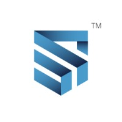
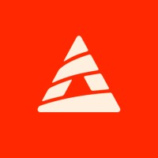

<h1 align="center">Welcome to my profile 🙋‍♂️</h1>

  

    
    
    
    
    
  

  

    
    
  

## About me

Innovate tech professional with 4+ years of experience working as a Full Stack Developer, where delivered successful projects across the world with multicultural teams and distinctive and modern technologies such as JavaScript, TypeScript, NodeJS, VueJS, PHP, Laravel and AWS. Capable of working with various technologies and software solutions in the most diverse segments and teams. My specialities and interests include Software and Web Development, Programming Languages, Artificial Intelligence and Blockchain Development & Web3.0. If you are interested, check my curriculum vitae in the [link](https://docs.google.com/document/d/1k-huyj7Ao5NEy0reBUe9AI8PXiiT-w4Z5NsdiJkEIrg).

## Experiences

**Full Stack Developer** \
[**Fone.Ninja**](https://fone.ninja) • Contract • Remote \
**Period**: `May 2024` - `Present` \
**Industry**: `Software Development` \
**Stack**: Typescript, Node.js, Vue.js, PrimeVue, Tailwind, Docker, Laravel, AWS
 

**Full Stack Developer** \
[**DefSafe**](https://defsafe.com) • Contract • Remote \
**Period**: `Mar 2024` - `May 2024` \
**Industry**: `Computing and Network Services` \
**Stack**: Typescript, Nuxt.js, Tailwind, Supabase, AWS, Azure, GCP, OpenAI
 

**Full Stack Developer** \
[**Dacxi Chain**](https://dacxichain.com) • Contract • Remote \
**Period**: `Feb 2023` - `Apr 2024` \
**Industry**: `Financial Services` \
**Stack**: Typescript, Vite, Tailwind, Vue.js, Laravel, Docker, AWS
 

**Full Stack Developer** \
[**Wealth99**](https://wealth99.com) • Contract • Remote \
**Period**: `Apr 2022` - `Apr 2024` \
**Industry**: `Financial Services` \
**Stack**: Typescript, Node.js, Vite, Tailwind, Vue.js, Laravel, Docker, AWS
 

**Full Stack Developer** \
[**Athen Labs**](https://athenlabs.io) • Freelance • Remote \
**Period**: `Jun 2023` - `Jul 2023` \
**Industry**: `IT services and consulting` \
**Stack**: Typescript, Node.js, Next.js, Nuxt.js, Vercel, Tailwind
 

**Software Developer** \
[**UFPA**](https://ufpa.br) • Internship • On-site \
**Period**: `Sep 2021` - `Apr 2022` \
**Industry**: `Higher Education` \
**Stack**: Javascript, Bootstrap, Node.js, Angular, Vue.js, Python, Java
 

## Education

**Information Systems** \
[**UFPA**](https://ufpa.br) • Belém, PA, Brazil \
**Degree**: `Bachelor Degree` \
**Period**: `Jun 2021` - `Present`
 

**Software Architecture** \
[**Anhanguera**](https://anhanguera.com) • Remote \
**Degree**: `Specialisation (Lato Sensu)` \
**Period**: `Jun 2021` - `Present`
 

**Software Engineering** \
[**UniFECAF**](https://unifecaf.com.br) • Remote \
**Degree**: `Specialisation (Lato Sensu)` \
**Period**: `Sep 2021` - `Apr 2022`
 

**Logistics Management** \
[**UNIP**](https://unip.com) • Belém, PA, Brazil \
**Degree**: `Bachelor of Technology` \
**Period**: `Aug 2019` - `Jul 2021`
 

**Environmental and Sanitary Engineering** \
[**UEPA**](https://www.uepa.br/) • Belém, PA, Brazil \
**Degree**: `Bachelor's Degree` \
**Period**: `Feb 2020` - `Dec 2020`
 

## Main technologies

