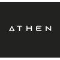

<h1 align="center">Welcome to my profile 🙋‍♂️</h1>

  

   
   

  

    
    
    
    
    
  

  

    
    
    <!--  -->
  

## About me

I'm Gabriel Santos Cardoso, paraense (Brazil), 22 years old, and always open to new opportunities. Innovate Full Stack professional with 4+ years of experience working as a Full Stack Developer. Capable of working with various technologies and software solutions in the most diverse segments and multi-cultural teams. Among my professional goals are to always be in contact with the most modern technologies and best practices in the technology market, add my skills and competencies and bring value to any team I may be part of. My specialities include Software and Web Development, Artificial Intelligence and Blockchain/Web3.

If you are interested, check my curriculum vitae in the [link](https://docs.google.com/document/d/1k-huyj7Ao5NEy0reBUe9AI8PXiiT-w4Z5NsdiJkEIrg).

Please feel free to contact me to talk about business and studies, or to exchange a good idea with colleagues.

## Experiences

**Full Stack Developer** \
[**Fone.Ninja**](https://fone.ninja) • Contract • Remote \
Period: `May 2024` - `Present` \
Industry: `Software Development`
 

I was employed by Fone Ninja, a technology company based in Brazil that specialises in solutions for businesses in the telecommunications sector. My work involved using technologies such as JavaScript, TypeScript, Node.js, Vue.js, PHP, Laravel, MySQL, Docker, AWS, and various third-party services for invoicing, digital signatures, and more. I was responsible for enhancing, implementing new features, and maintaining the payment and membership systems, as well as making improvements and bug fixes across the entire ERP system. Additionally, I was assigned to oversee the Technical Support module, where I carried out numerous end-to-end improvements and added new functionalities, including Service Orders, Electronic Checklists, financial integrations, digital signatures, and other relevant features, all with a focus on usability and user experience.

**Full Stack Developer** \
[**DefSafe**](https://defsafe.com) • Contract • Remote \
Period: `Mar 2024` - `May 2024` \
Industry: `Computing and Network Services`
 

I was employed by DefSafe, a US-based company specialising in cybersecurity and artificial intelligence solutions. During my time there, I worked with cutting-edge technologies such as NuxtJS, TypeScript, Nitro, Supabase, Prisma, PostgreSQL, AWS Cognito, AWS Lambda, AWS CloudWatch, and AWS Amplify. I was responsible for implementing UI improvements and bug fixes, as well as integrating with APIs. Additionally, I was tasked with implementing social login functionality based on AWS Cognito identity federation. This involved integrating with OAuth 2.0 mechanisms such as LinkedIn, and email services like Google and Microsoft Outlook. I was also responsible for implementing SAML/SSO integration using AWS Cognito.

**Full Stack Developer** \
[**Dacxi Chain**](https://dacxichain.com) • Contract • Remote \
Period: `Feb 2023` - `Apr 2024` \
Industry: `Financial Services`
 

I was employed by Dacxi Chain, a global crowdfunding company founded and based in Australia. During my time there, I worked with technologies such as TypeScript, TailwindCSS, Vite, Playwright, Vitest, Laravel, PHP, Laravel Nova, Laravel Vapor, AWS, Docker, OpenAPI, MySQL, Redis, and AWS Amplify. I was responsible for developing user interfaces, integrating and maintaining APIs, and conducting integration, unit, and end-to-end (E2E) testing using Vitest, Playwright, and Pest.

**Full Stack Developer** \
[**Wealth99**](https://wealth99.com) • Contract • Remote \
Period: `Apr 2022` - `Apr 2024` \
Industry: `Financial Services`
 

I was employed by Wealth99, a global exchange founded in Australia. At this company, I worked with technologies such as JavaScript, TypeScript, Vue.js, Node.js, Webpack, Vite, PHP, Laravel, Laravel Nova, Docker, OpenAPI, MySQL, MongoDB, and Redis. I also gained experience with blockchain node services like Ethereum Geth and had brief exposure to smart contracts in Solidity. Initially, I was responsible for developing, maintaining, and fixing bugs on the frontend, as well as implementing new features such as dashboards, financial charts, and improvements to the financial transaction history. After gaining experience, I joined the backend team, where I primarily focused on implementing new features such as Mixpanel integrations, fixing specific issues, enhancing the API, improving performance, and creating tests using PHPUnit.

**Full Stack Developer** \
[**Athen Labs**](https://athenlabs.io) • Freelance • Remote \
Period: `Jun 2023` - `Jul 2023` \
Industry: `IT services and consulting`
 

Freelance work where worked with technologies such as HTML, CSS, Javascript, Node.js, React.js, NextJS, NuxtJS, Typescript, TailwindCSS, DaisyUI, Vite, Vitest, Supabase, Prisma, Vercel and GitHub Actions. Development of graphical interfaces, implementation of new features, integration with APIs, unit and integration tests using Vitest and Jest. Development of REST API using the MVC pattern, the development of client features using NuxtJS Server and Supabase.

**Software Developer** \
[**UFPA**](https://ufpa.br) • Internship • On-site \
Period: `Sep 2021` - `Apr 2022` \
Industry: `Higher Education`
 

Internship PROAD scholarship holder at the Department of Development of Technological and Informational Products of the Federal University of Pará Central Library. Worked with the development of graphical interfaces and maintenance of systems developed with HTML, CSS, Javascript, PHP, Vue.js version 2, Nuxt.js version 2, Node.js and Bootstrap. Also, I worked with the development and maintenance of digital repositories using DSpace, Java and Python, where he supported UFPA's institutional repositories and also developed a new dedicated repository for cataloguing patents.

## Education

**Information Systems** \
[**UFPA**](https://ufpa.br) • Belém, PA, Brazil \
Degree: `Bachelor Degree` \
Period: `Jun 2021` - `Present`
 

**Software Architecture** \
[**Anhanguera**](https://anhanguera.com) • Remote \
Degree: `Specialisation (Lato Sensu)` \
Period: `Jun 2021` - `Present`
 

**Software Engineering** \
[**UniFECAF**](https://unifecaf.com.br) • Remote \
Degree: `Specialisation (Lato Sensu)` \
Period: `Sep 2021` - `Apr 2022`
 

**Logistics Management** \
[**UNIP**](https://unip.com) • Belém, PA, Brazil \
Degree: `Bachelor of Technology` \
Period: `Aug 2019` - `Jul 2021`
 

**Environmental and Sanitary Engineering** \
[**UEPA**](https://www.uepa.br/) • Belém, PA, Brazil \
Degree: `Bachelor's Degree` \
Period: `Feb 2020` - `Dec 2020`
 

## Main technologies

### Languages, preprocessors and style generators

### Frameworks and libraries

### Database/ORMs and Cloud Services

### Tools set and more

### Stu(dying) and interests

